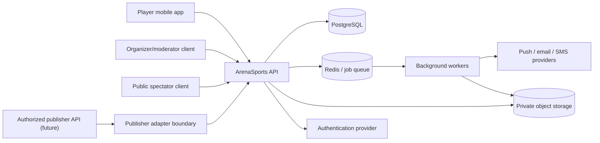

# ArenaSports architecture

## 1. Approach

ArenaSports begins as a modular monolith with a shared PostgreSQL database and explicit domain boundaries. This keeps transactions, deployment, and debugging manageable for a small team while preserving extraction seams for future scale.

Microservices are not a maturity badge. A module is extracted only when measured load, isolation, deployment cadence, or ownership requires it and an ADR documents the change.

## 2. System context



Game clients do not connect through ArenaSports. Players play in the publisher's game and return to ArenaSports with the match workflow.

## 3. Repository components

### `apps/mobile`

Expo/React Native application. Responsible for presentation, local input state, safe caching, connectivity feedback, and calling versioned API contracts. It never computes authoritative standings, deadlines, eligibility, or result finalization.

### `apps/api`

Fastify HTTP application and modular-monolith composition root. Responsible for authentication context, authorization, validation, domain orchestration, transactions, rate limits, idempotency, audit emission, and safe responses.

### `packages/contracts`

Zod schemas, enums, stable error codes, pagination shapes, and DTO types shared between API and mobile. Database models are not exposed directly.

### `packages/database`

Prisma schema, generated client boundary, migrations, and transaction helpers. Domain services depend on narrow repository interfaces where practical.

## 4. Domain modules

### Identity

ArenaSports accounts, profiles, game identities, sessions, roles, blocks, and account state. Authentication proves an external subject; ArenaSports authorization decides resource access.

### Games

Game catalog, platforms, regions, game-specific public identity fields, supported evidence types, and ruleset presets. A future publisher adapter registers capabilities here.

### Tournaments

Drafts, publication, rule versions, access policy, registration, waitlist, invitations, participant snapshots, lifecycle, organizer roles, and announcements.

### Competition

Seeding, deterministic fixture generation, brackets, rounds, standings, scoring, tie-breakers, advancement, and snapshots.

### Matches

Fixture window, check-in, availability proposals, match reference, submissions, confirmation, resolution versions, reschedules, forfeits, voids, and finalization transaction.

### Integrity

Evidence metadata, upload authorization, disputes, review assignment, decisions, appeals, suspicion signals, conflicts of interest, and retention.

### Notifications

Durable in-app notifications, delivery preferences, push/email/SMS adapters, templates, retry, and delivery outcomes.

### Trust and safety

Reports, blocks, sanctions, moderator scope, minors/safeguarding flags, content policy, and escalation.

### Audit

Append-only integrity events, actor/target references, correlation IDs, redacted participant timeline, and administrative query tools.

## 5. Request path

1. Fastify assigns a correlation ID.
2. Authentication plugin resolves the external subject and ArenaSports user.
3. Rate limit and abuse controls evaluate the route.
4. Zod validates params/query/body.
5. Authorization policy checks the action and resource scope.
6. Application service invokes domain policy.
7. Database transaction locks or guards the current version where needed.
8. State change and audit event commit together.
9. Outbox event commits in the same transaction.
10. Worker later delivers notifications or media work.
11. Response maps domain data to a versioned contract.

A request must not enqueue irreversible external work before its database transaction commits.

## 6. Match finalization transaction

Finalization is the highest-risk normal operation. In one transaction it must:

- lock or conditionally update the match version;
- verify current state allows the resolution;
- insert an immutable resolution version;
- mark referenced submissions/evidence state;
- update the match's active resolution;
- apply standings or bracket advancement exactly once;
- append audit and participant-timeline events;
- append notification/outbox events;
- record the algorithm/ruleset versions used.

A unique finalization key and version guard prevent retries from double-awarding points.

## 7. Evidence flow

1. Client requests upload authorization for a specific match and evidence type.
2. API verifies participant/reviewer access, size/type policy, and case state.
3. API returns a short-lived object key authorization.
4. Client uploads directly to private object storage.
5. Storage event or explicit completion creates scan work.
6. Worker validates size/type, calculates or confirms digest, scans content, and marks availability.
7. Authorized viewers request short-lived read access.
8. Retention job deletes object content when due while preserving permitted integrity metadata.

Original filenames are not trusted object keys. Evidence is never public-by-guessable-URL.

## 8. Result-provider boundary

```ts
interface ResultProvider {
  readonly provider: string;
  capabilities(gameId: string): Promise<ResultProviderCapabilities>;
  verify(input: VerifyExternalMatchInput): Promise<ExternalMatchAssertion>;
}
```

The initial `EvidenceResultProvider` does not call a game service. It evaluates ArenaSports submissions and review outcomes. Future authorized adapters must attach provider, external reference, event time, received time, integrity signature state, and raw-payload retention policy.

No adapter may bypass the central resolution/finalization policy.

## 9. Security boundaries

- Mobile devices are untrusted.
- Organizer status does not grant platform-admin access.
- Moderator access is case-scoped and audited.
- Object storage is private.
- Debug logs are not audit logs.
- Authentication provider claims are mapped, not blindly trusted for ArenaSports roles.
- Webhooks require signature verification, timestamp tolerance, replay protection, and idempotency.
- Queue messages contain references, not unnecessary sensitive payloads.
- Production database access is exceptional and audited.
- Secrets are supplied at runtime, never in the repository or mobile bundle.

## 10. Data and consistency

PostgreSQL is the system of record. Redis accelerates queues, throttling, and ephemeral coordination but does not own tournament truth.

Strong consistency is required for:

- registration capacity;
- tournament lifecycle transitions;
- ruleset publication;
- match finalization;
- standings/bracket advancement;
- moderator decisions;
- sanctions.

Eventual consistency is acceptable for:

- push delivery;
- feed projection;
- analytics;
- search indexing;
- non-critical counters.

## 11. API design

- Base path `/v1`.
- JSON over HTTPS.
- Zod contracts.
- Cursor pagination for growing collections.
- Stable error envelope and error codes.
- `Idempotency-Key` on retryable mutations.
- `If-Match` or explicit version for high-contention edits.
- UTC RFC 3339 timestamps.
- No database record returned directly.

See `docs/API.md`.

## 12. Deployment topology

Initial staging/production shape:

- containerized API;
- separately scalable worker process from the same codebase;
- managed PostgreSQL with point-in-time recovery;
- managed Redis-compatible service;
- private S3-compatible bucket;
- CDN only for public static assets;
- managed authentication;
- push/email provider adapters;
- centralized logs, metrics, error reporting, and uptime checks.

A single region near the launch users is acceptable initially if backups and recovery are credible. Region selection must be documented before collecting production personal data.

## 13. Reliability

- Transactional outbox for durable async events.
- Bounded exponential retry with dead-letter visibility.
- Idempotent consumers.
- Health endpoints distinguish liveness and readiness.
- Graceful shutdown stops accepting work and drains requests.
- Database migrations run as controlled release steps.
- Backup restoration is exercised before launch.
- Emergency tournament pause is an audited platform action.

## 14. Scaling path

1. Add read replicas/caching only after query measurement.
2. Separate worker capacity from API.
3. Partition evidence/media processing from transactional work.
4. Extract notifications/search/analytics if independent scaling helps.
5. Preserve a single integrity finalization authority unless a formal distributed consistency design replaces it.
6. Add authorized regional/publisher adapters behind contracts.

## 15. Architecture quality gates

A consequential change requires:

- threat and privacy impact;
- authorization decision;
- idempotency/retry behavior;
- audit behavior;
- migration/recovery plan;
- observability;
- tests for failure and concurrency;
- ADR if it changes a durable system boundary.
